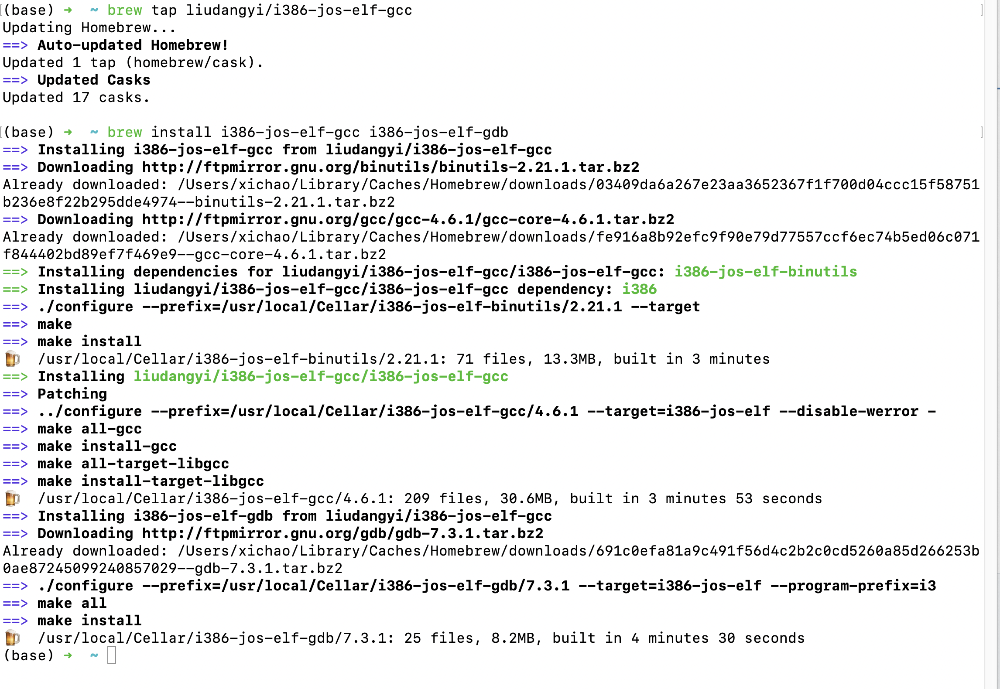
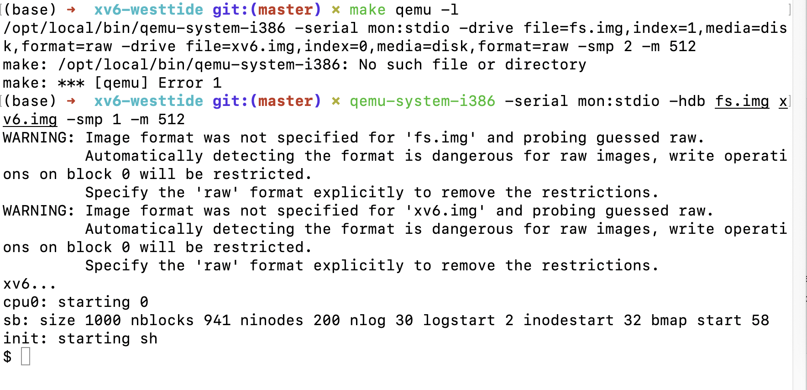
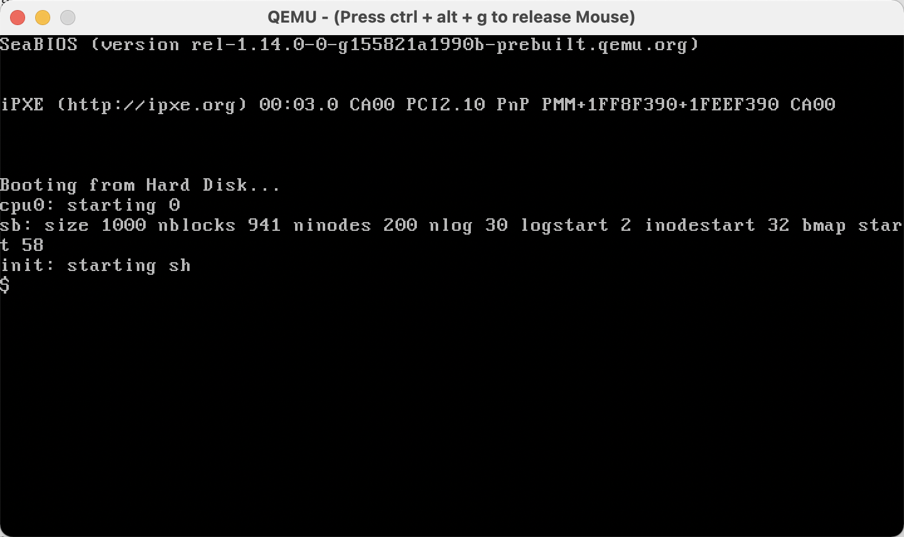

# Build log

### for xv6-westtide

#### install build-essentials

```
$ brew tap liudangyi/i386-jos-elf-gcc
$ brew install i386-jos-elf-gcc i386-jos-elf-gdb
# macOS 需要先安装 brew,过程中会进行本地编译,需要一定的时间
```



为了能和6.828的 code 共用 i386-*-elf-gcc

修改 Makefile

```
# line39

TOOLPREFIX := i386-jos-elf-		

# 修改这里为i386-jos-elf-,让make能够找到i386-jos-elf-gcc/gdb

# line81

CFLAGS = -fno-pic -std=gnu99 -static -fno-builtin -fno-strict-aliasing -O2 -Wall -MD -ggdb -m32 -march=i686 -Werror -fno-omit-frame-pointer

# 修改 -std 参数为 gnu99, 其他可用参数详见 man i386-jos-elf-gcc
```

#### build

```
$ make
$ make qemu
# -l 参数可以减少输出信息
# 会出现一条不影响结果的报错
$ qemu-system-i386 -serial mon:stdio -hdb fs.img xv6.img -smp 1 -m 512
```



成功输出模拟的界面

(释放鼠标: 先按 g ,再 ctrl + alt )

### 6.828/2018

#### install build-essentials

```
$ brew tap liudangyi/i386-jos-elf-gcc
$ brew install i386-jos-elf-gcc i386-jos-elf-gdb
# macOS 需要先安装 brew,过程中会进行本地编译,需要一定的时间
```


```
https://github.com/westtide/homebrew-i386-jos-elf-gcc
```

